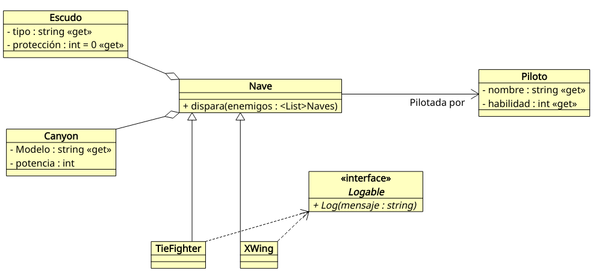

## Cas Pràctic 1

Realitzarem la simulació d'un joc de naus espacials per torns on s'enfrontaran dos bàndols.

Per a això, en primer lloc, implementarem les següents classes i les seues relacions:



Més o menys, podem entendre la relació entre elles, però textualment, podríem descriure el diagrama de la següent manera:

* Una Nau es compon d'un escut i un canó, i està pilotada per un pilot.
* Una nau pot ser un Tie Fighter o un XWing.
* A més, tenim la interfície *Logable*, que implementen tant Tie Fighters com XWings, i que simplement *compromet* a aquestes classes a implementar un mètode `Log` que mostrarà els missatges per la pantalla. (Com observareu, es tracta d'una relació una miqueta forçada, però és perquè treballeu també les interfícies)

D'altra banda, en el mètode principal del programa, definirem dues estructures:
* La Flota Imperial, composta per Tie Fighters.
* La flota Rebel, composta per XWings.

L'ordre *lògic* en el qual hauries de començar a crear les classes vindria determinat per les relacions existents entre elles, de manera que aniríem generant primer les classes (i interfícies) que no tenen cap associació, agregació o composició o que no hereten d'unes altres, i després les classes que sí que ho fan. 

Amb això en ment, podríem generar les classes en el següent ordre.

1. Classe Piloto
2. Classes Escudo i Canyon
3. Classe Nave (ja que requereix de les tres anteriors)
4. Interfície *Logable*
5. Classes XWing i TieFighter, derivades de nau i que implementen la interfície Logable.


**Funcionament de la simulació.**

Crea dues col·leccions, una que serà FlotaRebelde i una altra que serà FlotaImperial.
Crea també dos tipus de canó i d'escut, cadascun per a un tipus de nau:

* Canó c1: Tipus "C1" i potència 5,
* Canó c2: Tipus "C2" i potència 4,
* Escut e1: Tipus "E1" i protecció 4,
* Escut e2: Tipus "E2" i protecció 5.

Els XWing tindran el canó c1 i l'escut e1, mentre que els Tie Fighers tindran el canó e2 i l'escut e2.

Amb això, afegim les següents naus:

A la flota Rebel (els escuts i canons per defecte):

* XWing pilotat per *Luke Skywalker*, amb habilitat 9, 
* XWing pilotat per *Wedge Antilles*, amb habilitat 7, 
* XWing pilotat per *Jek Porkins*, amb habilitat 4

A la flota Imperial (els escuts i canons per defecte):

* TieFighter pilotat per *Darth Vader*, amb habilitat 10
* TieFighter pilotat per *Trooper1*, amb habilitat 5
* TieFighter pilotat per *Trooper2*, amb habilitat 5

La simulació consistirà en un bucle que finalitzarà quan un dels dos bàndols es quede sense naus.

Enn cada iteració, se seleccionarà una nau aleatòria de cada bàndol perquè dispare. Per a això, calculem un número aleatori entre 0 i la longitud de cada llista, i accedim a aqueixa posició de la llista. Al mètode `dispara` li proporcionem la llista de naus de l'altre bàndol.

Dins del mètode `dispara`, seleccionem una nau contrària també aleatòriament, i disparem sobre ella. Per a determinar si s'abateix la nau enemiga s'obtenen dues quantitats, de la següent manera:

```
Habilitat del pilot * potencia del canó * Número aleatori entre 1 i 2.
```

A més, cada vegada que es dispare, es mostrarà per pantalla si falla el dispar o a qui abat, mitjançant el mètode *Log* heretat de la interfície *Logable*.

Quan s'abata una nau contrària, aquesta s'eliminarà de la llista, i quan una de les dues llistes es quede buida, acaba la simulació, mostrant el bàndol guanyador.

Una possible eixida de la simulacións seria:

```
Wedge Antilles falla
Darth Vader falla
Luke Skywalker falla
Darth Vader abat a Wedge Antilles
Luke Skywalker falla
Darth Vader abat a Luke Skywalker
Jek Porkins falla
Darth Vader abat a Jek Porkins 

Guanya el Bàndol Imperial
```

>
> Prova a fer pel teu compte l'exercici abans de veure la solució a la carpeta ex1.
>


### Variant

Una vegada fet l'exercici anterior, podríes incloure alguna refactorització? Hi ha, per exemple algún mètode que tinga el mateix fucionament en dues classes diferents? Com podríes simplificar el codi?

>
> Si ens fixem al disseny i a la solució proposada, el mètode *dispara* de les classes *XWing* i *TieFighter* que hereten de *Nau* (on es defineix com a abstracta) és exactament el mateix.
>
> Aquest mètode podréim eliminar-lo doncs de les subclasses i fer la implementació directament en la classe *Nau*, de manera que el mateix codi servira tant per a aquestes dos classes com per a qualsevol altra que derivem de nau.
>
> Això implicaría, a més, que la interfície *Logable*, en lloc de ser implementada per les subclasses, sería implementada per la classe *Nau*, encara que la implementació *real* la ferem, ara sí en les subclasses, ja que cadascuna fa el *log* d'un color diferent.
>
> Bàsicament, el redisseny quedaría de la següent forma:
> 

## Cas Pràctic 2

Implementa l'exemple anterior fent ús de del patró de disseny Factory per tal de reduir-ne l'acoblament entre les diferentes classes.
