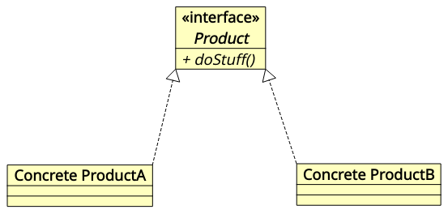
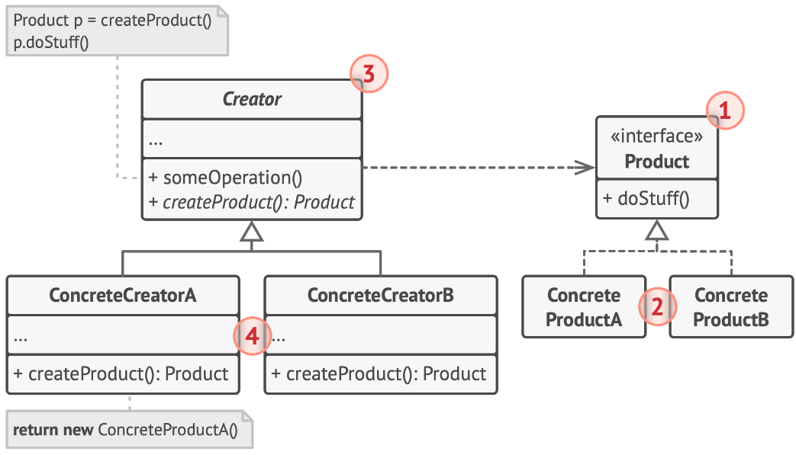
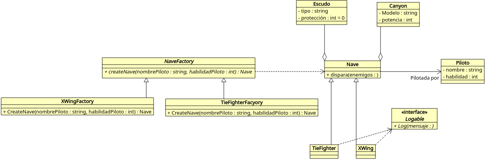

# Introducció

Una de les principals dificultats que heu d'afrontar quan comencen segon curs (a banda d'aprendre uns quants llenguatges nous) és el bot de programar aplicacions pràcticament sense llibreríes a haver de realitzar aplicacions ja no en un llenguatge, sinò en un framework concret (Spring, Android, PyQT, Flutter, etc.)

Els frameworks són eines de desenvolupament que integren diversos mòduls i eines que permeten crear aplicacions d'una forma relativament àgil fent ús de llibreríes o funcionalitats ja creades. 

Un dels aspectes més rellevants dels frameworks a nivell de programació, aixó com d'alguns SDKs, com l'SDK d'Android, és que es fonamenten en l'ús del que es coneix com **patrons de disseny**, que s'assenten en la programació orientada a objectes. 

En aquest document veurem una xicoteta introducció a aquests patrons de disseny, que us aprofitaran per refrescar i aprofundir en els conceptes tractats durant el curs de programació orientada a objectes.

Els patrons de disseny, com veurem, ens ajudaran a oferir una major qualitat del nostre codi, i permeten que amb el temps, aquest siga més mantenible i reutilitzable.

# Patrons de disseny

Els patrons de disseny podríen definir-se com solucions *efectives* i reconegudes a problemes comuns d'arquitectura i desenvolupament de programari.

No es tracta de porcions de codi específiques, ni d'algorismes que detallen pas a pas una solució, sinó d'una idea, que podem personalitzar i adaptar a la realitat d'un problema per a resoldre'l o per a obtindre un codi més fàcil de mantindre i ampliar.

Els patrons podem agrupar-los en tres grans famílias: 

* Els **patrons creacionals**, orientats a la creació d'objectes,
* Els **patrons estructurals**, que ofereixen una guia per a compondre elements de programari en estructures majors, i
* Els **patrons de comportament**, que tracten algorismes per assignar responsabilitats entre objectes.

No veurem tots els patrons, però és interessant saber reconéixer-los quan estiguem desenvolupant aplicacions. Patrons com *Builder*, *Decorator*, *Adapter*, *Iterator* o *Singleton* són presents en moltes solucions o estrategis de programació que veureu al llarg del mòdul.

::: tip
**Sobre patrons de disseny**

* Enllaç a *refactoring Guru*, lloc web sobre diversos aspectes relatius a la qualitat del programari:
[https://refactoring.guru/es/design-patterns](https://refactoring.guru/es/design-patterns)
:::

## Els principis SOLID

Abans d'entrar en matèria, anem a vore alguns conceptes teòrics sobre qualitat de programari.

Els principis SOLID tenen per finalitat el desenvolupament d'un programari de qualitat, concretament:

* Crear programari eficaç, que complisca la seua funció i siga robust i estable, i
* Escriure codi net, flexible davant canvis, fàcil de modificar, reutilitzar i mantindre.

L'ús de patrons ajuda doncs a aconseguir aquests objectius i a complir els principis SOLID, que ens permet crear sistemes amb alta cohesió i baix acoblament.

### Acoblament i cohesió

L'acoblament i la cohesió són dues mètriques de qualitat del programari, i es poden definir de la següent manera:

* **Acoblament**: Grau d'interdependència entre unitats de programari (classes, mètodes, biblioteques...). Un baix acoblament implica que podem fer canvis en una unitat sense que hàgem de modificar altres.

* **Cohesió**: Grau en què diferents components del sistema treballen de manera conjunta millor que per separat. Una alta cohesió implica que moltes unitats de programari es troben agrupades creant una unitat major (classes, llibreríes...)

### Principis SOLID

SOLID és un acrònim que resumeix aquests principis per a un programari de qualitat:

* **S**: *Single Responsibility Principle* o Principi de responsabilitat única: *Una classe, component o miceoservei ha de ser responsable d'una única cosa.*
* **O**: *Open/Closed Principle* o principi de *obert/tancat*: *Les classes i mètodes han d'estar oberts per a la seua extensió, però tancats per a la seua modificació.*
* **L**: *Liskov Substitution Principle*, o principi de substitució de Liskov: *Una classe derivada ha de ser substituïble per la seua classe base*. Amb això, obtenim jerarquies de classes fàcils d'entendre i codi reutilitzable.
* **I**: *Interface Segregation Principle* o principi de Segregació de la interfície: *Una classe que implemente una interfície hauria d'utilitzar tota la seua funcionalitat*. Si només utilitza una part d'aquesta, hauríem de segregar aqueixa interfície en diverses interfícies.
* **D**: *Dependency Inversion Principle* o Principi d'inversió de dependència: *Les dependències han d'estar en les abstraccions, no en les concrecions*.

:::tip 
**Més informació...**

Disposeu de més informació, amb exemples sobre els principis SOLID en el següent article:
[https://enmilocalfunciona.io/principios-solid/](https://enmilocalfunciona.io/principios-solid/)
:::

### SOLID, qualitat del programari i patrons

L'aplicació d'aquests principis facilita a la llarga el treball, tant de desenvolupament com de manteniment, principalment quan diversos desenvolupadors treballen en un mateix projecte. Amb l'aplicació d'aquests principis aconseguim:

* Millorar el manteniment del nostre codi
* Facilitem afegir noves funcionalitats,
* Afavoreix la reusabilitat i qualitat del codi, així com la seua encapsulació.

Tot això comporta un esforç que a la llarga acaba sent molt beneficiós per a la *salut* del nostre programari, manteniment i el seu futur creixement.

I què tenen a veure els patrons programari amb això? Molt. Com comentem al principi, es tracta de *patrons* que s'adapten a un problema o determinada situació comuna, i ens ofereixen una resposta que ja compleix amb aquests principis de qualitat.

Al següent apartat anem doncs a veure com abordaríem alguns d'aquests patrons de diseny.

# Patrons de disseny

Com hem comentat, els patrons de disseny es divideixen en tres grans categoríes: Els patrons creacionals, els estructurals i els de comportament.

A la llarga dels diferents mòduls de segon curs es treballa amb diversos patrons de tots tres tipus. Anem a veure alguns d'ells, els més senzills, per tal d'anar familiaritzant-nos-en.

## Patrons de disseny creacionals

Els patorns de disseny creacionals estan orientats a la creació d'objectes, i alguns dels que veurem al segon curs són el patró Singleton o el Patró Builder. En aquest apartat anem a aprofundir en el patró Singleton i el patró Factory, que és semblant però més senzill que el patró Builder.

### El patró Singleton

El patró Singleton, permet assegurar-nos que una classe tinga únicament una única instància en un moment donat, proporcionant un punt d'accés global a aquesta instància. 

Aquest és un patró habitual en classes on hem d'accedir a algun recurs compartit, com puga ser una base de dades o un arxiu.

A nivell d'utilització, el funcionament és relativament senzill: Quan instanciem un objecte d'una classe que ja hem instanciat prèviament, en lloc d'obtindre un nou objecte, obtenim una referència a aquest.

Aquest comportament no es pot implementar amb un constructor tal com hem vist, ja que la invocació al constructor retorna sempre un objecte nou.

La forma d'implementar aquest patró Singleton és, d'una banda, **fer privat el constructor per defecte**, de manera que evitem que es puga utilitzar l'operador `new`, i per una altra, **crear un mètode públic estàtic que faça de constructor**. Internament, la primera vegada que s'invoca el mètode, es crea l'objecte i es guarda de manera estàtica. En següents invocacions, en lloc de crear de nou l'objecte, el que fem és retornar la referència a l'objecte ja creat. D'aquesta manera, ens assegurem que únicament existeix una instància de l'objecte.

Vegem en el següent codi autodocumentat com implementaríem aquest patró:

```java
public final class ClasseSingleton {
    private String recurs;

    // Referència estàtica a la pròpia classe
    public static ClasesSingleton classeSingleton;

    // Constructor per defecte (privat!)
    private ClasseSingleton(){}

    // Mètode que obté una instància de la classe
    public static ClasseSingleton getClasseSingleton(){
        // Si no existeix l'objecte classeSingleton, el creem
        if (classeSingleton==null)
            classeSingleton=new ClaseSingleton();
        // I el retornem
        return classeSingleton;
    }

    public void setRecurs(String recurs){
        this.recurs=recurs;
    }

    public String getRecurs(){
        return recurs;
    }
  
}
```

Com veiem, la classe s'ha definit amb el modificador `final`, que evita que no es puguen derivar altres classes a partir d'aquesta.

Amb això, podríem implementar el següent mètode principal, al qual declarem dos objectes de la classe `ClaseSingleton`:

```java
    public static void main(String[] args) {
        ClasseSingleton classe1=ClasseSingleton.getClasseSingleton();
        classe1.setRecurs("Hola");
        ClasseSingleton classe2=ClasseSingleton.getClasseSingleton();
        System.out.println(classe2.getRecurs()); 
    }
```

Observeu que hem modificat la propietat recurs des de l'objecte classe1, i l'hem consultat des de classe2, sent aquest el mateix. Aquest recurs podria ser, com hem comentat, una connexió a una base de dades o un recurs compartit, que requereix d'accés exclusiu.

### El patró Factory

:::warning
Abans de començar amb aquest apartat, és convenient que relitzes l'exercici 1, ja que el següent text utilitza aquest com a punt de partida.
:::

El patró *Factory Method* és un altre dels patrons de tipus *creacional* relativament senzill, que proporciona una interfície per a la creació d'objectes en una superclasse i permet a les subclasses alterar el tipus d'objectes que es creen.

Vegem el problema amb el següent exemple.

 *Crear una nau de tipus XWing pilotada per Luke Skywalker, amb habilitat 9, amb escut E1 i canó C1*. Per a això, faríem alguna cosa com:

```java
XWing xwing=new XWing(
 new Pilot("Luke Skywalker", 9), 
 new Canyon("C1", 5),
 new Escut("E1", 4));
```

Amb això, estem afegint un **acoblament** entre la classe en què es trobe aquest codi i les classes XWing, Pilot, Canyon i Escut. En el moment en què hàgem d'afegir, per exemple una cabina a la nau, o modificar la construcció de pilots, canons o escuts, haurem de realitzar diverses modificacions al llarg del codi.

Ací és on apareix el patró Factory i defineix una operació a banda per a la creació de l'objecte: el mètode *Factoria*. 

En aquest patró, el codi de l'objecte que crearem (conegut com a *producte*) s'externalitza a una classe a banda. Aquesta serà una classe abstracta, coneguda com a *Factoria* (*Creator*), que delega la instanciación de l'objecte en una classe derivada (*ConcreteCreator*).

Veurem el patró en el següent diagrama UML, del llibre *Patrons de Disseny* d'Alexander Shvets.

Per a això, vegem abans la situació original. Tindríem la interfície *Product* amb el mètode *doStuff* que implementarien les classes *Concrete ProductA* i *Concrete ProductB*.

{ width=350px }

Amb aquesta situació de base, el patró *Factory* es representaria mitjançant el següent diagrama de classes:

{ width=450px }

Vegem-ho de forma detallada:

1. La interfície `Product` és comuna a tots els objectes que es poden crear.
2. Els *Productes Concrets* realitzen implementacions diferents d'aquesta interfície.
3. Introduïm ara la *Factoria* o classe *Creator* i les subclasses, que implementen el mètode de factoria (*Factory Method*) `createProduct`. Adoneu-vos que totes elles retornen un objecte de tipus `Product`. Aquest mètode `createProduct` pot declarar-se com *abstract* en la classe base per a forçar que totes les subclasses implementen les seues pròpies versions.
4. Les classes `ConcreteCreator` sobreescriuen aquest mètode de factoria de la classe base, retornant cadascuna un tipus diferent de producte. 

Amb això, no creem en la nostra aplicació els objectes mitjançant `new`, sinó mitjançant aquest mètode de factoria. Encara que el `new` es continua fent, evidentment en les subclasses `concreteCreator`.

### 3.1. Aplicació del patró a l'exemple de les naus

Anem a veure com aplicaríem aquest patró al nostre exemple de les naus.



Adoneu-vos que hem afegit la classe abstracta NaveFactory amb el mètode de fàbrica *createNave*, també abstracte, i que implementen les seues dues classes filles, XWingFactory i TieFighterFactory.

Amb això, el codi de les classes existents no varia, sinó que únicament afegim les tres classes de factoria, i a més, modifiquem el programa principal perquè utilitze el Factory en lloc de les classes concretes.

Vegem el codi de les noves classes:

```java
package com.ieseljust.batallaEspacial;

public abstract class NaveFactory {
    abstract public Nave createNave(String nombrePiloto, int habilidadPiloto);
}
```

Adoneu-vos que no hem afegit al mètode createNave el tipus de canó ni d'escut, ja que ara, ho generarem des de la pròpia factoria de naus concretes.

```java
package com.ieseljust.batallaEspacial;

public class XWingFactory extends NaveFactory {
    @Override
    public Nave createNave(String nombrePiloto, int habilidadPiloto) {
        // Ací creem i retornem la nau TieFifhter
        Piloto pilot = new Piloto(nombrePiloto, habilidadPiloto);
        Canyon c = new Canyon("C2", 4);
        Escudo e = new Escudo("E2", 5);
        return (new XWing(pilot, c, e));
    }
}
```

I la classe TieFighterFactory és pràcticament igual que aquesta:

```java
package com.ieseljust.batallaEspacial;

public class TieFighterFactory extends NaveFactory {

    @Override
    public Nave createNave(String nombrePiloto, int habilidadPiloto) {
        // Ací creem i retornem la nau TieFifhter
        Piloto pilot = new Piloto(nombrePiloto, habilidadPiloto);
        Canyon c = new Canyon("C2", 4);
        Escudo e = new Escudo("E2", 5);
        return (new TieFighter(pilot, c, e));
    }
}
```

Així doncs, el codi de generació de la nau:

```java
XWing xwing=new XWing(
 new Pilot("Luke Skywalker", 9), 
 new Canyon("C1", 5),
 new Escut("E1", 4));
```

Queda de la següent manera:

```java
XWingFactory xwf=new XWingFactory();
Nave xwing=xwf.createNave("Luke Skywalker", 9);
```

Amb això hem *desacoblat* el codi del nostre programa de la construcció dels objectes. D'aquesta manera, no ens importa com s'implemente WXing internament. Únicament, obtenim un objecte d'aquesta classe i l'usem en el nostre codi.

:::important
**Un patró és una idea, no una *recepta***

Recordeu que un patró de disseny representa una idea, però no és una *recepta* o *plantilla* que hajam d'aplicar tal qual. De fet, si s'adoneu, al diagrama UML on hem explicat el model, les classes concretes no deriven d'una superclasse, sinò d'una interfície. No obstant això, al nostre exercici, hem pogut aplicar el patró fent ús d'una superclasse, en lloc d'una interfície.
:::

A la documentació sobre patrons de disseny del lloc web [Refactoring Guru](https://refactoring.guru/es/design-patterns) disposeu d'una gran quantitat de patrons de disseny que podeu llegir i treballar. En el pròxim curs, es trobareu alguns patrons de tipus creacional (com Builder) i estructurals (com Adapter), entre d'altres, però durant aquet curs, potser sense saber que eren patrons de disseny, ja heu treballat amb alguns, com el patró estructural *Decorator*, que haureu utilitzat amb els *Streams*, o el patró de comportament *Iterator*, que ens permet recórrer col·leccions sense importar el tipus de dades subjacents.

## Referències

:::note
* Factory Method en refactoring.guru: [https://refactoring.guru/es/design-patterns/factory-method](https://refactoring.guru/es/design-patterns/factory-method)
* Exemple de Factory Method amb Java en Refactoring Guru: [https://refactoring.guru/es/design-patterns/factory-method/java/example](https://refactoring.guru/es/design-patterns/factory-method/java/example)
* Artículo sobre el patrón Factory: [https://www.ionos.es/digitalguide/paginas-web/desarrollo-web/patron-factory/](https://www.ionos.es/digitalguide/paginas-web/desarrollo-web/patron-factory/)
:::


